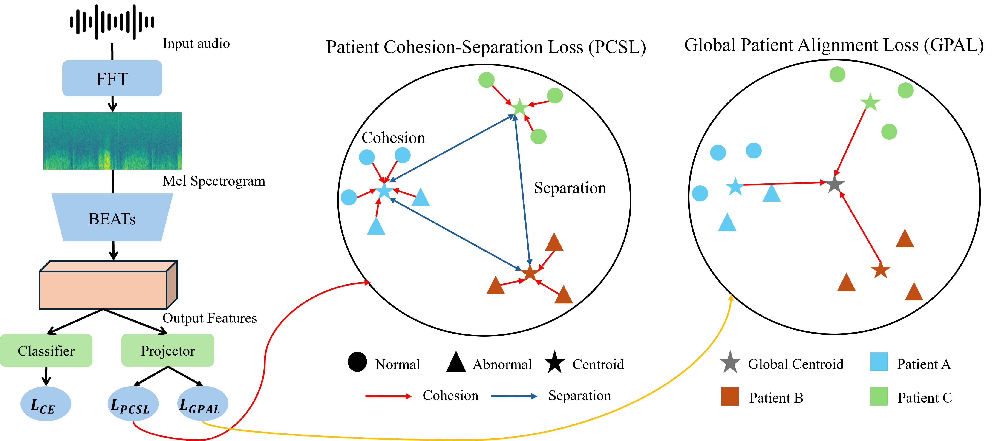

# Patient-Aware Feature Alignment for Robust Lung Sound Classification

<p align="center">  </p>

> **Official Code** of:  **“Patient-Aware Feature Alignment for Robust Lung Sound Classification.”**


This repository provides the **Patient-Aware Feature Alignment (PAFA)** framework to tackle lung sound classification under challenging conditions where data are highly imbalanced and patient variability is substantial. Our approach uses two key objectives:

1. **Patient Cohesion-Separation Loss (PCSL)**: Clusters feature representations of the same patient while keeping different patients’ features well-separated.  
2. **Global Patient Alignment Loss (GPAL)**: Aligns all patient centroids toward a global reference point to maintain a coherent global feature space.

Through these patient-level losses, our method aims to balance inter-patient variability while preserving class-discriminative power. **PAFA** achieves strong performance on the **ICBHI 2017** dataset, showing improved sensitivity and overall robustness compared to standard training methods.


## Requirements

Install the necessary packages with:
```bash
# Install PyTorch + Torchaudio (adjust the CUDA version accordingly)
pip install torch torchvision torchaudio --extra-index-url https://download.pytorch.org/whl/cu117

# Install additional requirements
pip install -r requirements.txt
```

## ICBHI Data
We use the ICBHI 2017 Challenge Respiratory Sound Database in our experiments.

Download the dataset using the following commands:
```bash
wget https://bhichallenge.med.auth.gr/sites/default/files/ICBHI_final_database/ICBHI_final_database.zip
or 
wget --no-check-certificate https://bhichallenge.med.auth.gr/sites/default/files/ICBHI_final_database/ICBHI_final_database.zip
```

## Pretrained weight

For BEATs model, you can download weight file at "https://github.com/microsoft/unilm/tree/master/beats" 

We use 'BEATs_iter3+ (AS2M)' model weight for our experiment.


## Run
### 1) Training
Below is an example command to train the model. Adjust the parameters (batch size, learning rate, etc.) as needed.
```bash
# Beats + CE
bash scripts/beats_ce.sh

# Beats + PAFA 
bash scripts/beats_pafa.sh
```

### 2) Evaluation
```bash
# Beats + CE
bash scripts/beats_ce_eval.sh

# Beats + PAFA 
bash scripts/beats_pafa_eval.sh
```

Note that change --pretrained_ckpt with your directory.

## Result
<p align="center">  </p>
<p align="center">  </p>


PAFA (CE + PCSL + GPAL) consistently improves sensitivity and overall ICBHI Score compared to standard cross-entropy training. Notably, variance in patient-level accuracy is reduced, indicating more uniform performance across different patients.


## Contact
Seung Gyu Jeong : wa3229433@gmail.com
